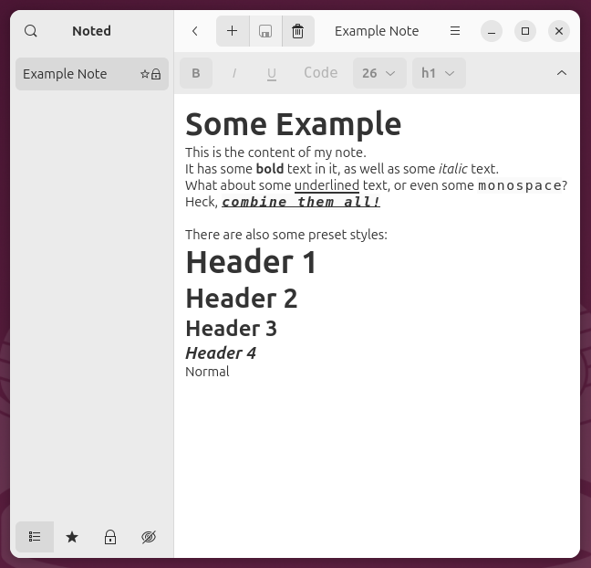
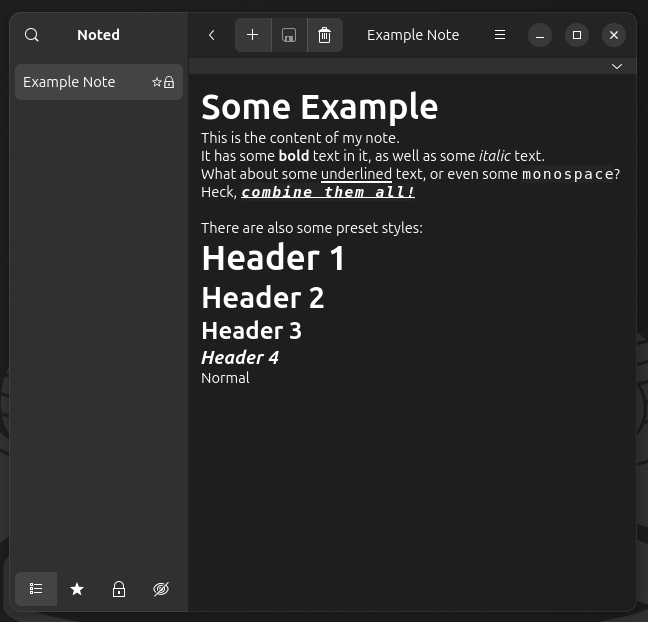

<h1 align="center">
    Noted
</h1>

<p align="center">
    Basic notes application written in <a href='https://gjs.guide/'>GJS</a> (GNOME JavaScript),
    <br>
    utilising a <a href='https://www.gtk.org/'>Gtk</a> user interface styled with 
    <a href='https://gnome.pages.gitlab.gnome.org/libadwaita/doc/1.3/index.html'>libadwaita</a>.
</p>

<p align='center'>


</p>

## Features

- Totally offline - notes only saved to local file system
- Pre-defined note categories (Favourite, Locked, Hidden)
- Toggleable styles (bold, italic, underline, monospace, font size)
- Style presets (Headers 1-4, normal)
- Customisable keyboard shortcuts

## Installation

You can download the flatpak file from the [latest release page](https://github.com/devklick/noted-gtk/releases/latest). 
To install, first make sure you have the flatpak relevant runtime installed:
```
flatpak install --user flathub org.gnome.Platform//47
```
Then you can installed Noted via the flatpak file you downloaded:
```
flatpak install --user io.github.devklick.noted.flatpak
```

> [!NOTE]  
> Gnome 47 is no longer supported, but there are issues rendering some icons
> on later versions of Gnome. Noted will stay on 47 until these issues are fixed.

## Keyboard Shortcuts

There are a lot of keyboard shortcuts for common actions, such as starting a new note, changing text styles etc. You can view and edit these shortcuts in Preferences > Key Bindings.

## Issues and Workarounds

### Open Notes Meta File

There's an option in the Burger Menu > Open, called Notes Meta File, which opens 
a JSON file that contains various metadata about each note in the Noted application. 
Depending on the apps available on your system, it may try to open the file in an 
application that struggles to display the contents, sor example, Firefox.

One way to get around this is to manually tell gio which application to use when opening 
files that use this mime type.

List possible applications:
```
gio mime application/json
```
Example output:
```
Registered applications:
	org.gnome.TextEditor.desktop
	firefox_firefox.desktop
	libreoffice-writer.desktop
Recommended applications:
	org.gnome.TextEditor.desktop
	firefox_firefox.desktop
```

Set the application you want to use for this mime type:
```
gio mime application/json org.gnome.TextEditor.desktop
```
This means that the Notes Meta File will now be opened in the Gnome Text Editor.

> [!NOTE]  
> This change will affect all JSON files you try to open.
> <br/>To revert this change, run:
> ```
> gio mime --reset application/json
> ```

### Open Notes Directory

Similar to the Notes Meta File, there's an option to open the Notes Directory, 
and it's possible that your system will try to open this in the wrong application. 

If you want to change the application that opens, first list the possible apps:
```
gio mime inode/directory
```
Example output:
```
Registered applications:
	org.gnome.Nautilus.desktop
	org.gnome.baobab.desktop
Recommended applications:
	org.gnome.Nautilus.desktop
	org.gnome.baobab.desktop
```
Set the application you want to use for this mime type:
```
gio mime inode/directory org.gnome.Nautilus.desktop
```
This means that the Notes Directory will now be opened in the Nautilus (Aka Files).

> [!NOTE]  
> This change will affect all Directory links you try to open.
> <br/>To revert this change, run:
> ```
> gio mime --reset inode/directory
> ```